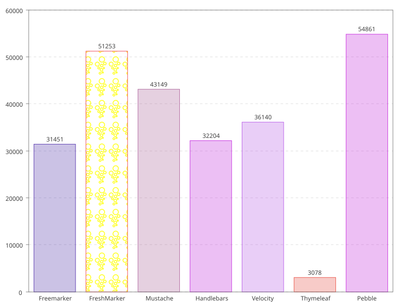

= FreshMarker

_FreshMarker_ is an embedded _Java 21_ Template-Engine, which is inspired by _FreeMarker_.
Most of the basic concepts are the same.

The scope of _FreshMarker_ is the processing of templates at runtime with sufficient programming functions. The templates do not need to be precompiled and can therefore be adapted at runtime.
This is an advantage for use in tools and for large quantities of stored templates in text form.

Despite reduced programming functions, _FreshMarker_ is open to new data types and integrated functions.

In particular, the lack of modern data types such as `java.time.LocalDate` in _FreeMarker_ was the reason for implementing _FreshMarker_.

You can find a detailed description of all _Freshmarker_ features in the manuals for
https://schegge.gitlab.io/freshmarker/1.11.0[version 1.11.0]
,
https://schegge.gitlab.io/freshmarker/2.0.0[version 2.0.0]
and
https://schegge.gitlab.io/freshmarker/2.1.0[version 2.1.0].

The https://gitlab.com/schegge/freshmarker/-/blob/develop/RELEASE_NOTES.adoc[release notes] contains changes to the template engine since version 1.4.6.

Some in-depth articles on _Freshmarker_ can be found on https://schegge.de/category/freshmarker/[schegge.de].

A https://gitlab.com/schegge/freshmarker/-/blob/develop/src/main/resources/fmcs.pdf[cheat sheet] for _FreshMarker_ is also available.

== Example Benchmarks

|===
.8+| |mustache | 0.9.11
|freemarker | 2.3.23
|velocity | 1.7
|thymeleaf | 2.1.4.RELEASE
|trimou | 1.8.2.Final
|handlebars | 4.0.1
|pebble | 2.2.1
|freshmarker | 2.2.0-SNAPSHOT
|===

== Usage

[source,xml]
----
<dependency>
include::pom.xml[lines=7..9]
</dependency>
----

== Examples

.Simple Example
[source,java]
----
Configuration configuration = new Configuration();
Template template = configuration.builder().getTemplate("test", "temporal=${temporal}, path=${path.size}");
String result = template.process(Map.of("temporal", LocalTime.of(12, 30), "path", Path.of("text.pdf")));
----

.List with loop Variable
[source,java]
----
Template template = configuration.builder().getTemplate("ancestors-loop",
    """
    <#list ancestors as ancestor with loop>
      ${loop?index}. ${ancestor.givenname} ${ancestor.surename}
    </#list>
    """);
String result = template.process(Map.of("ancestors", ancestorService.ancestorsByFamily("Kaiser")));
----

.Partial reduction of a Template
[source,java]
----
Template template = configuration.builder().getTemplate("ancestors-loop",
    """
    <h1>$title</h1>
    <#list ancestors as ancestor with loop>
      ${loop?index}. ${ancestor.givenname} ${ancestor.surename}
    </#list>
    """);
Template reduced = template.reduce("title", "Genealogy List");
String result = reduced.process(Map.of("ancestors", ancestorService.ancestorsByFamily("Kaiser")));
----
