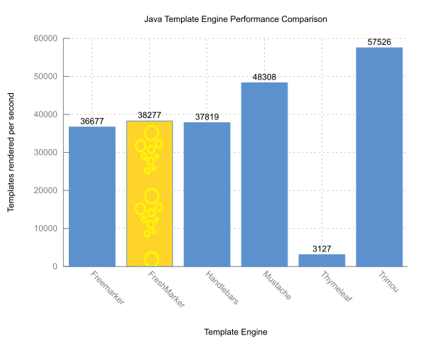

= FreshMarker

A simple, small but powerful template engine based loosely on the _FreeMarker_ syntax. _FreshMarker_ is implemented in Java 17 (Java 21 since version 1.0.0) and supports the `java.time` API and Records.

== Example Benchmarks

|===
.8+| |pebble | 2.2.1
|mustache | 0.9.11
|freemarker | 2.3.23
|velocity | 1.7
|thymeleaf | 2.1.4.RELEASE
|trimou | 1.8.2.Final
|rocker | 1.3.0
|freshmarker | 1.4.4
|===

== Usage

[source,xml]
----
<dependency>
include::pom.xml[lines=7..9]
</dependency>
----

== Examples

.Simple Example
[source,java]
----
Configuration configuration = new Configuration();
Template template = configuration.builder().getTemplate("test", "temporal=${temporal}, path=${path.size}");
String result = template.process(Map.of("temporal", LocalTime.of(12, 30), "path", Path.of("text.pdf")));
----

.List with loop Variable
[source,java]
----
Template template = configuration.builder().getTemplate("ancestors-loop",
    """
    <#list ancestors as ancestor with loop>
      ${loop?index}. ${ancestor.givenname} ${ancestor.surename}
    </#list>
    """);
String result = template.process(Map.of("ancestors", ancestorService.ancestorsByFamily("Kaiser")));
----

.Partial reduction of a Template
[source,java]
----
Template template = configuration.builder().getTemplate("ancestors-loop",
    """
    <h1>$title</h1>
    <#list ancestors as ancestor with loop>
      ${loop?index}. ${ancestor.givenname} ${ancestor.surename}
    </#list>
    """);
Template reduced = template.reduce("title", "Genealogy List");
String result = reduced.process(Map.of("ancestors", ancestorService.ancestorsByFamily("Kaiser")));
----

You can find a detailed description of al FreshMarker features in the https://gitlab.com/schegge/freshmarker/-/blob/develop/src/main/asciidoc/manual.adoc[manual].

The https://gitlab.com/schegge/freshmarker/-/blob/develop/RELEASE_NOTES.adoc[release notes] contain changes to the template engine since version 1.4.6.

== Template Types

|===
|Type | Java Type(s) | Template Type

|String|`String`,`StringBuffer`,`StringBuilder`|TemplateString
|String|`URI`,`URL`,`UUID`|TemplateString
|Number|`BigInteger`, `Long`, `Integer`, `Short`, `Byte`|TemplateNumber
|Number|long`, `int`, `short`, `byte`,`double`, `float`|TemplateNumber
|Number|`BigDecimal`, `Double`, `Float`|TemplateNumber
|Boolean|`Boolean`, `boolean`|TemplateBoolean
|DateTime|`LocalDateTime`, `Date`|TemplateDateTime
|Date|`LocalDate`, `java.sql.Date`|TemplateDate
|Time|`LocalTime`, `java.sql.Time`|TemplateTime
|Duration|`Duration`|TemplateDuration
|Period|`Period`|TemplatePeriod
|File|`File`|TemplateFile
|Path|`Path`|TemplatePath
|Sequence|Lists|TemplateListSequence
|Map|Maps|TemplateBean
|Bean|Beans|TemplateBean
|Record|Records|TemplateBean
|Enum|Enums|TemplateEnum
|Null|-|TemplateNull
|Version|-|TemplateVersion
|Locale|`Locale`|TemplateLocale
|===

== Template Directives

|===
| Name | Comment

| If/ElseIf/Else |
| Switch/Case/Default | Without Break/Fallthrough
| Interpolation | Dot-Key, Dynamic-Key, Built-ins, Method Call, Exists, Default value operator
| Interpolation: Dynamic Key| Sequence, Range, String
| Interpolation: Dot Key | With Identifier on Beans, Records and Maps
| Interpolation: List | Sequence, Range (not right unlimited), Hash and Bean
| Interpolation: Default value operator | No implicit (missing) value
| Macro | With Return and Nested, but without Nested Loop Variables
|===

== Built-ins

|===
|Name | Type | Comment

| upper_case | String | uppercase by current locale
| lower_case | String | lowercase by current locale
| camelCase | String | from _kebab-case_ or snake_case_
| kebabCase | String | from _camelCase_
| snake_case | String | from _camelCase_
| screaming_snake_case | String | from _camelCase_
| trim | String |
| length | String |
| contains | String |
| ends_with | String |
| boolean | String |
| version | String |
| locale | String |
| c    | DateTime, Date, Time |
| string | DateTime, Date, Time | Not for the legacy temporal types
| date | DateTime, Date |
| time | DateTime, Time |
| c    | Boolean |
| then | Boolean |
| string | Boolean |
| name | Path, File |
| parent | Path, File | path is file system dependent
| size | Path, File |
| exists | Path, File |
| is_file | Path, File |
| is_directory | Path, File |
| index | Loop Variable |
| counter | Loop Variable |
| is_first | Loop Variable |
| is_last | Loop Variable |
| has_next | Loop Variable |
| item_parity | Loop Variable |
| item_parity_cap | Loop Variable |
| c | Enum | Enum name
| ordinal | Enum | Enum ordinal
| major | Version |
| minor | Version |
| patch | Version |
| is_before | Version |
| is_equal | Version |
| is_after | Version |
| lang | Locale |
| language | Locale |
| country | Locale |
|===

== Built-in Variables

|===
| Name | Description | Type
|lang | the language part of the current locale | String
|country | the country part of the current locale | String
|locale | the current locale | Locale
|now | the current date-time | DateTime
|version | the current version | Version
|===
